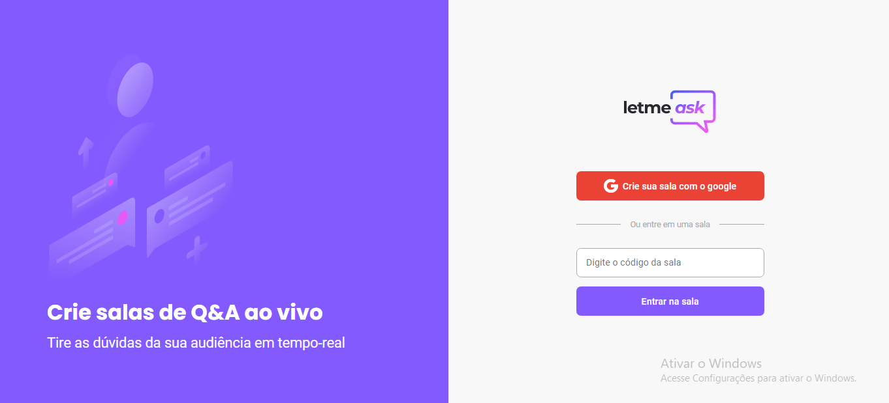

   <h1 align="center">
      
   </h1>

   <h2 align="center">
      Junte as perguntas da sua audiência em um só lugar.
   </h2>

   
Plataforma interativa de perguntas em tempo real.

   

      <a href="#-Tecnologias">Tecnologias</a>&nbsp;&nbsp;&nbsp;|&nbsp;&nbsp;&nbsp;
      <a href="#-Dependencias">Dependencias</a>&nbsp;&nbsp;&nbsp;|&nbsp;&nbsp;&nbsp;
      <a href="#-licença">Licença</a>
   

   

   <h3>Para vizualizar a aplicação<a href="https://letmeask-22598.web.app/"> clique aqui</a></h3>

   <h1></h1>

   ## ⚙ Tecnologias

   Aplicação criada utilizando create react-app e template typescript:

   - [React](https://reactjs.org)
   - [Typescript](https://www.typescriptlang.org/)
   - [Firebase](https://firebase.google.com/)

   

   ### 📁 Dependencias
   
   - firebase
   - node-sass
   - react-router-dom

   ### 📝 Licença
   
   - [Licença MIT](LICENSE.md)